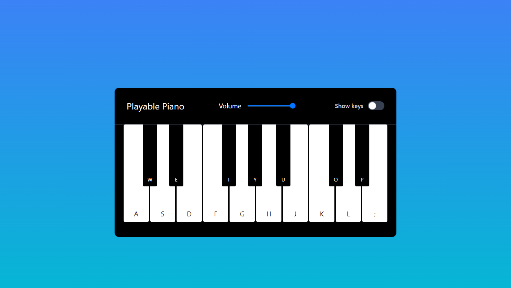
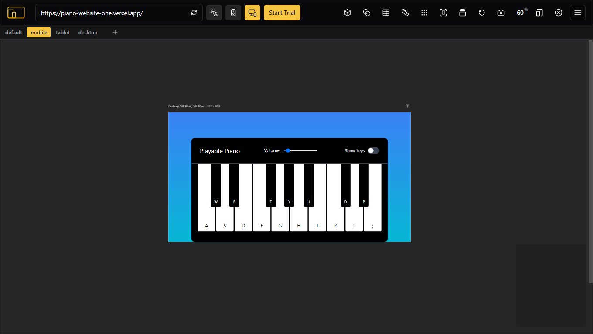

# Piano Website

A fully responsive piano web application created using HTML, Tailwind CSS, and JavaScript. The piano can be played using both a mouse and keyboard keys, offering an interactive experience for users of all devices.

## Live Demo

[Piano Website](https://piano-website-one.vercel.app/)

## Technologies Used

-   HTML : Markup structure for the web application.

-  Tailwind : Utility-first CSS framework for styling and responsive design.

-  JS : For interactivity, sound playback, and handling user input.

## Features

- Responsive Design: The website is fully responsive and adapts to different screen sizes, ensuring a smooth experience on both desktop and mobile devices.
- Interactive Piano: Users can play the piano using either mouse clicks or keyboard keys.
- Volume Control: Adjust the piano's volume using an on-screen slider.
- Toggle Key Labels: Option to show or hide the labels on the piano keys.
- Predefined Songs: Play predefined songs like "Happy Birthday" and "Jingle Bells" by triggering them programmatically.

## Project Screenshot

### In Desktop

### In Mobile

